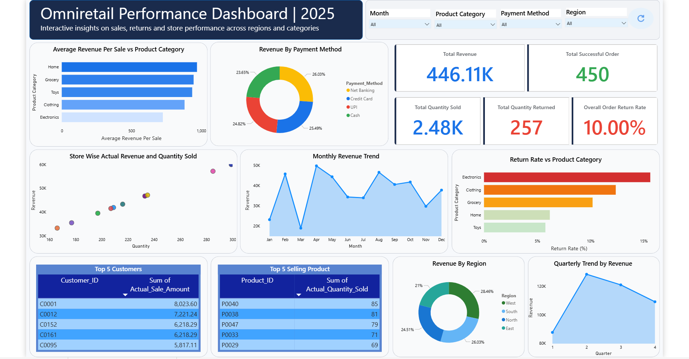
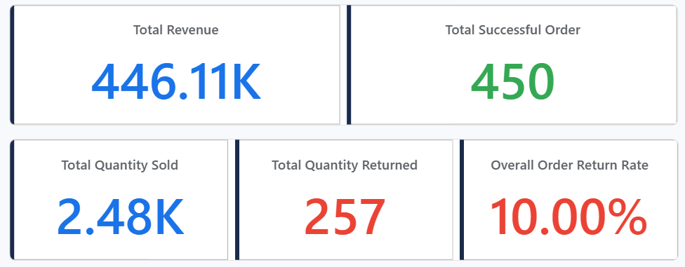
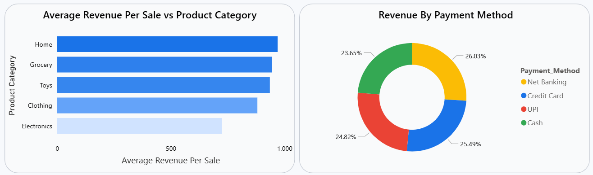
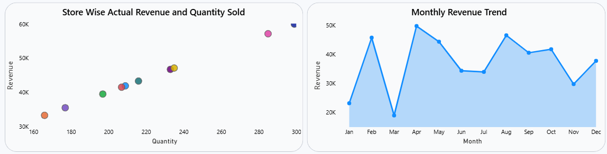
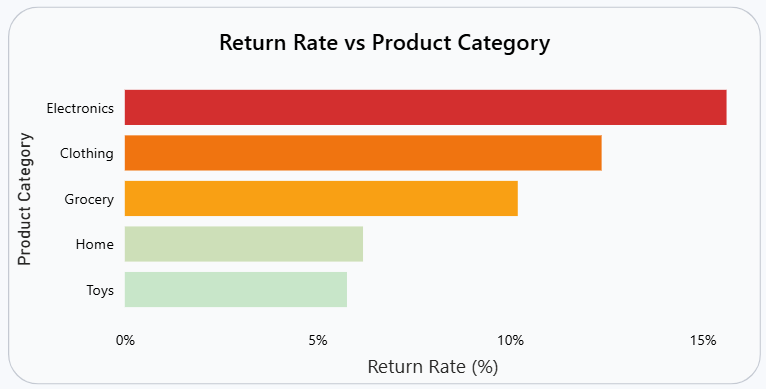
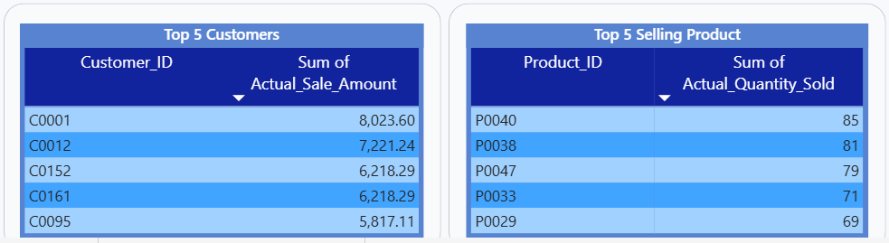
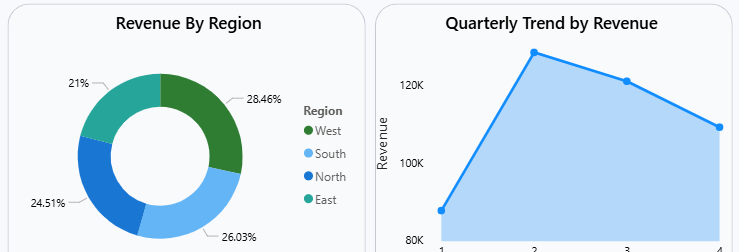

# Omniretail Sales Analysis Dashboard

Retail sales analytics dashboard built using **MySQL and Power BI**.

This project analyzes retail transaction data to understand revenue performance, product trends, customer behavior, and return patterns across different regions.
The raw dataset was initially not in an analysis-ready format, so it was first cleaned and transformed using SQL before building the dashboard.

---

## Dashboard Overview

---

## Key Performance Indicators

---

## Product Category & Payment Insights

---

## Sales Trend Analysis

---

## Return Rate Analysis

---

## Customer & Product Insights

---

## Regional Revenue Distribution

---

## Key Insights

From the dashboard analysis, several observations can be made:

* The **Electronics** category shows the highest return rate among all product categories.
* Revenue trends fluctuate throughout the year with noticeable peaks in certain months.
* A small group of customers contributes significantly to the overall revenue.
* Regional sales distribution appears relatively balanced, with slight variation across regions.

These insights demonstrate how dashboard analytics can help identify patterns in sales performance and support data-driven decision making.

---

## Data Cleaning and Preparation

The original dataset was not structured in a format suitable for analysis.
The raw data required restructuring before it could be used for reporting and visualization.

Using **MySQL**, the dataset was cleaned and transformed into a proper tabular structure where each row represents a transaction and each column represents a variable.

The cleaning process included:

* Restructuring the raw dataset into column-wise format
* Standardizing column names
* Preparing fields for analytical calculations
* Creating an analysis-ready dataset for dashboard development

---

## Project Workflow

The development of this project followed these steps:

1. Raw retail dataset collection
2. Data cleaning and transformation using **MySQL**
3. Preparing analysis-ready structured data
4. Importing the cleaned dataset into **Power BI**
5. Creating KPI indicators and analytical visuals
6. Interpreting patterns and generating business insights

This workflow demonstrates the process of transforming raw data into meaningful analytical insights.

---

## Tools Used

* **MySQL** – Data cleaning and transformation
* **Power BI** – Dashboard design and visualization
* **SQL** – Data preparation and querying
* **Data Modeling** – Preparing data for analysis

---

## Author

Md. Rabbiul Hasan Rakib  
Statistics & Data Science  
Jahangirnagar University
